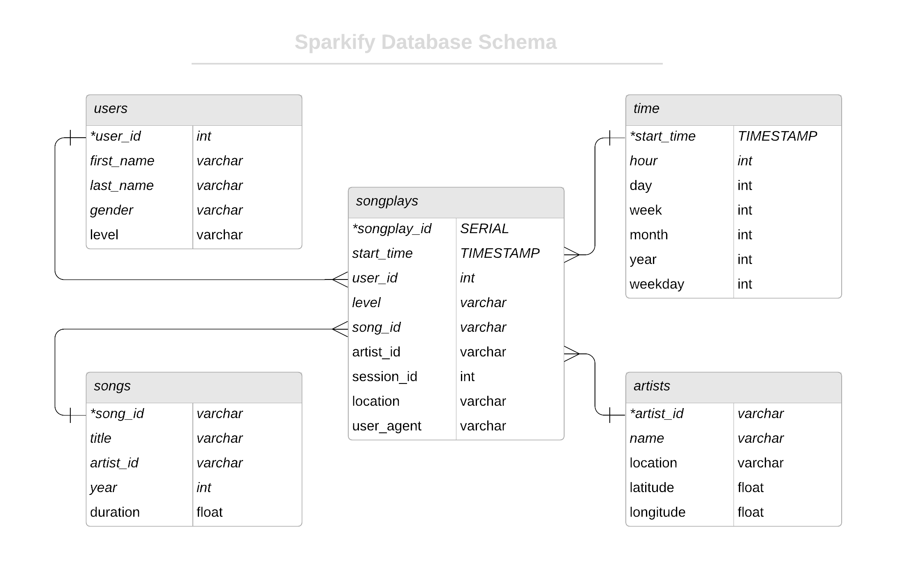

# Data Modelling with Postgres

## Introduction and Context
This project builds a Postgres database and ETL process that prepares and loads data for the startup Sparkify. Sparkify is a music streaming app, and wants to use the new database to understand what songs users are listening to. Currently Sparkify stores their data in json files and has no easy way to query.

### Project Objectives

1. Setup database with star schema
2. Determine ETL processes
3. Implement ETL pipeline and ingest data into database

### Technologies Used
- postgres database
- python
- pandas

## Database Schema
Below is the entity relation schema for the sparkify databse. Names of the fact and dimension tables are also provided. The design is a star schema and optimized for analytic queries. In this sense few joins are needed in order to pull insights from the underlying data.

### Table Descrptions

|Table Name | Type|
|---|---|
|songplays | fact |
|users | dimension|
|songs | dimension |
|artists | dimension|
|time | dimension |

## ETL Processing

The original data is stored in JSON format and must be converted before being inserted into the database. The main processing steps are:

1. The ts column from the logs file must be converted from a millisecond based timestamp to a datetime.
2. Values for hour, day, month, year, and day of the week must be extracted from the ts datetime value
3. Logs file must be filtered to contain only records of 'NextSong' value
4. Values from song_id and artist_id must be queried in order to complete absent columns in the songplays table.
