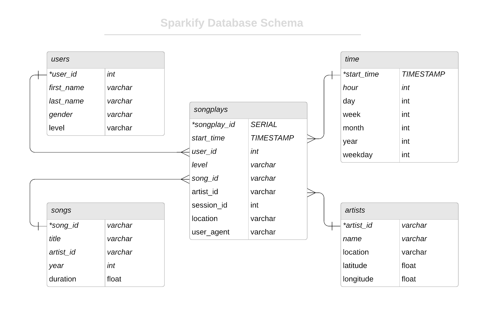

# Data Modelling with Postgres

## Introduction and Context
This project builds a Redshift and ETL pipeline for sparkify a muisc streaming service. As their userbase has grown Sparkify needs to scale up their database. Using original log files in JSON format this project builds the schema and ingestion scripts with python and SQL to propigate the new Redshift service.

### Project Objectives

1. Implement star schema in AWS Redshift
2. Stage data from S3 into Redshift
3. Load data from stage into star schema.

### Technologies Used
- AWS Redshift
- python
- Sql

## Database Schema
Below is the entity relation schema for the sparkify databse. Names of the fact and dimension tables are also provided. The design is     a star schema and optimized for analytic queries. In this sense few joins are needed in order to pull insights from the underlying dat    a.



 ### Table Descrptions

|Table Name | Type|
|---|---|
|songplays | fact |
|users | dimension|
|---|---|
|songplays | fact |
|users | dimension|
|songs | dimension |
|artists | dimension|
|time | dimension |

## ETL Processing
The original data is stored in JSON format in two AWS s3 buckets. In this project we run the ETL process within the Redshift cluster. To do this we copy the data from S3 to a pair of redshift tables used as staging. The two staging tables represent the log records and the song list respectively. From there we transform and insert the data into the tables outlined in the star schema.

## How to run script
1. Launch a AWS redshift cluster with an IAM role that allows read access to S3.
2. Open an incoming TCP port to be able to access the cluster.
3. Add your DB's details and ARN to the ```dwh.cfg``` file.
4. In the termal run ```python3 create_tables.py```
5. Followed by ```python3 etl.py```
